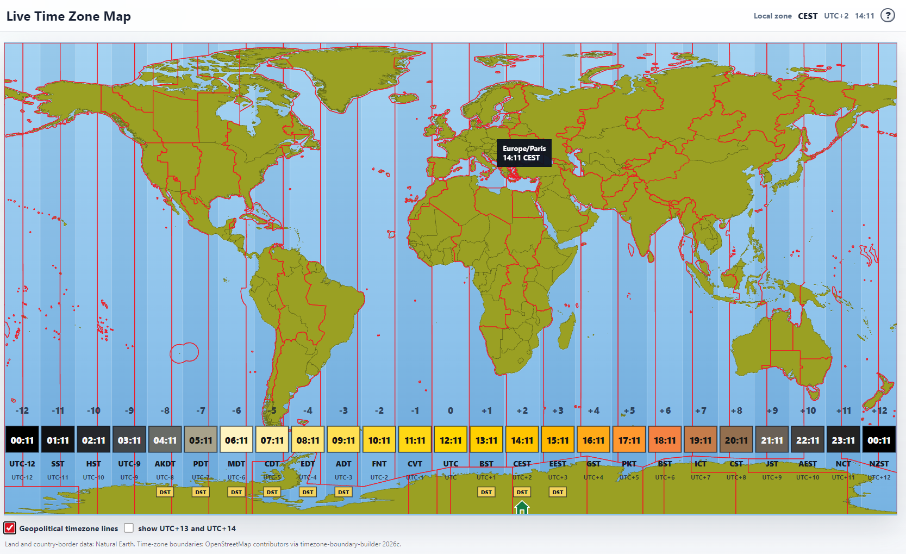

# Live Time Zone Map

A standalone HTML/SVG world time-zone map with live clocks for UTC-12 through UTC+14.

The page is built with plain HTML, CSS, and vanilla JavaScript. It does not use React or any frontend framework

Access the webpage: https://socarpl.github.io/worldtimezones/



## Features

- Responsive SVG world map.
- Live 24-hour `HH:MM` clocks for UTC-12 through UTC+12, with an optional checkbox to show UTC+13 and UTC+14.
- Clock colors change by local hour using a 24-hour daylight/dusk/night palette.
- Browser-local timezone detection using `Intl.DateTimeFormat`.
- Home icon under the user's current timezone column.
- DST badges with tooltip text.
- Clock square tooltips showing 12-hour `am/pm` time.
- Clickable timezone names that open related English Wikipedia pages in a new tab.
- Optional **Geopolitical timezone lines** overlay with hover tooltips across timezone regions.
- Region tooltips show the IANA timezone identifier and current local time with its abbreviation, for example `Europe/Paris` followed by `14:00 CEST`. They follow the cursor, stay within the window, and refresh while open.
- Windows 98-style About dialog.

## Timezone Labels and Updates

The bottom row shows one representative timezone per whole-hour UTC offset. It prefers the browser's local timezone when its current offset matches that column. It is not a list of every timezone on the map; regions with fractional-hour offsets can still be inspected through the geopolitical overlay.

Region tooltips use the timezone belonging to the hovered region. Their abbreviation can therefore differ from the bottom label at the same offset: Moscow can show `MSK` while another region sharing UTC+3 shows `EEST`.

Both use the same abbreviation helper, with predefined names where available and a browser-provided name or UTC offset as a fallback. Times use the browser's `Intl.DateTimeFormat` timezone rules. Seasonal changes update the time and applicable abbreviation, such as `CEST` to `CET` for Paris. The DST helper compares the current offset with January and July offsets; it is a heuristic rather than a complete history of timezone changes.

The page checks the time every second and redraws the clock row when the minute changes. It also refreshes when the page regains focus or becomes visible. Region tooltips refresh on each tick and hide when the pointer leaves a region, the overlay is disabled, the map scrolls, the window resizes or loses focus, or the About dialog opens.

## Run Locally

Open `index.html` directly in a browser.

No build step is required for normal use because `map-data.js` is already generated and committed.

## Repository Files

- `index.html` - the complete page UI and runtime logic.
- `map-data.js` - generated SVG path data used by the page.
- `tools/build-map-data.js` - script used to regenerate `map-data.js` from raw GeoJSON sources.
- `LTZM_Screenshot.png` - screenshot displayed in this README.

## Main Runtime Functions

The runtime functions are contained in `index.html`:

| Functions | Purpose |
| --- | --- |
| `renderStaticMap`, `renderGeographicData` | Draw offset bands, labels, land, country borders, and interactive timezone paths. |
| `activeClockOffsets`, `updateExtraZoneVisibility`, `updateTimezoneLineVisibility` | Apply the two checkbox settings and adjust the map width for extra clock columns. |
| `formatter`, `partsForZone`, `offsetMinutesForZone` | Cache date formatters and calculate local date parts and UTC offsets. |
| `formatTime`, `formatTimeAmPm`, `hourInZone` | Format clock and tooltip times and select the hour used for clock colors. |
| `isDstNow`, `browserShortName`, `displayAbbreviation` | Determine the DST indicator and select timezone abbreviations or offset fallbacks. |
| `chooseZoneForOffset`, `fixedOffsetZone`, `offsetLabel` | Choose each column's representative timezone and format UTC offset labels. |
| `renderClocks`, `renderDstBadge`, `renderHomeIcon`, `update` | Refresh clocks, colors, DST badges, the home marker, and the local readout. |
| `updateTimezoneTooltip`, `positionTimezoneTooltip`, `hideTimezoneTooltip` | Show live region details beside the cursor and keep the tooltip within the viewport. |
| `showTooltip`, `updateTooltipPosition`, `hideTooltip` | Handle the clock and DST badge tooltips. |
| `renderTimeZoneName`, `wikipediaUrlForTimeZone`, `openWikipediaForTimeZone` | Create keyboard-accessible timezone links and open the appropriate Wikipedia page. |
| `openAboutDialog`, `closeAboutDialog` | Show and dismiss the About dialog and restore focus. |

## Map Data

The committed `map-data.js` is generated from:

- Natural Earth land polygons.
- Natural Earth country boundary lines.
- timezone-boundary-builder 2026c timezone polygons.

The raw source files are intentionally not committed because they are large. They are expected under `data-src/`, which is ignored by Git.

## Regenerating Map Data

To regenerate `map-data.js`, place these files in `data-src/`:

- `ne_10m_land.geojson`
- `ne_10m_admin_0_boundary_lines_land.geojson`
- `timezones/combined-with-oceans-now.json`

Then run:

```bash
node --max-old-space-size=4096 tools/build-map-data.js
```

On Windows, if running from another working directory, set `TIMEZONES_ROOT` to the project folder before running the script.

## Credits

Developed by SOCAR and OpenAI Codex.

Map data:

- Natural Earth
- OpenStreetMap contributors via timezone-boundary-builder

## License

Copyright 2026 SOCAR.
